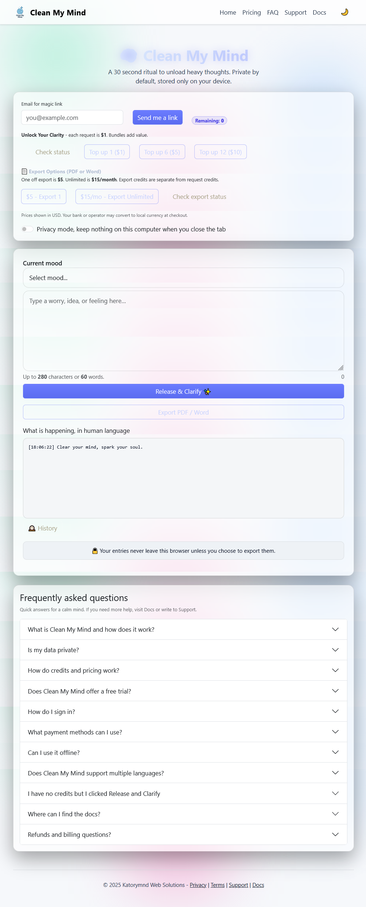
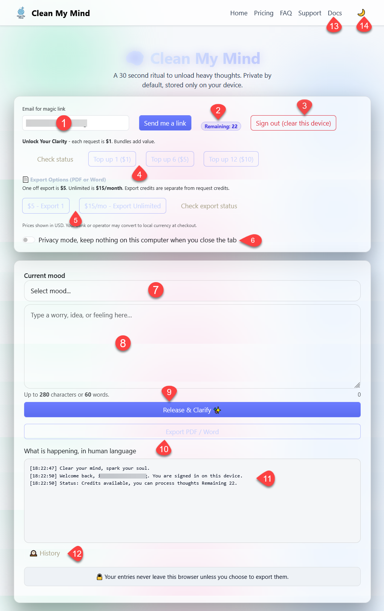

# 🧠 Clean My Mind

> *“The mind doesn’t need more apps. It needs space to breathe.”*

**Clean My Mind** is not an app.  
It’s a daily ritual — a quiet mirror for your thoughts.

No AI. No notifications. No cloud.  
Just you, your journal, and five minutes of honesty.

---

## What This Tool Does (In 3 Lines)

1. **Dumps** the noise from your head into a private text input — no filters, no judgment.  
2. **Focuses** you with silent 5-25-5 cycles — no distractions, just breath and stillness.  
3. **Reveals** patterns in your thinking — not with charts, but with repetition you can *feel*.

All data stays on your device.  
No server. No tracking. No sales pitch.

---

## Why This Exists

Most tools promise to “organize your mind.”  
They add tabs, tags, reminders, syncs — more clutter.

This tool does the opposite:  
It removes everything except the act of **speaking honestly to yourself**.

It was built for:
- The developer who stares at their screen until 2am  
- The student drowning in unspoken anxiety  
- The parent who hasn’t heard their own voice in weeks  
- Anyone who feels like their thoughts are screaming… but no one’s listening  

---

## How to Use

Clean My Mind is designed to be intuitive. Here’s a quick flow:

### 1. Open the Tool  
When you launch, you’re greeted with a clean, distraction-free screen.  

---

### 2. Usage in Details  
Here is what each element in the interface does:

1. **Email for magic link** — enter your email to receive a secure login link.  
2. **Remaining credits** — shows how many clarity requests you can still use.  
3. **Sign out (clear this device)** — removes your session and clears local data.  
4. **Top-up options** — add more request credits in affordable bundles.  
5. **Export options** — add more export your entries to PDF or Word (one-off or unlimited).  
6. **Privacy mode toggle** — toggle *on/off* - ensures nothing is saved after you close the tab.  
7. **Current mood selector** — pick your mood to frame the reflection session.  
8. **Main text box** — type your thoughts, worries, or ideas here (local-first).  
9. **Release & Clarify button** — processes your entry and completes the cycle. Here, your request credits will be used and the **Remaining credits** will  update  accordingly.
10. **Export PDF/Word** — When you  recieve the  response back you  can export it into **pdf/word** format  by clicking the  button. **Export credits** will be used for each export, if  available.  
11. **System status updates** — shows credits, sign-in confirmations, and actions.  
12. **History view** — lets you revisit past reflections stored in your browser.  
13. **Docs link** — opens this documentation for guidance and deeper details.  
14. **Dark mode toggle (🌙)** — switch between light and dark Aurora Glass themes.

---

## Explore Further

- [Overview](overview.md)  
- [Terms & Conditions](terms.md)  
- [Privacy Policy](privacy.md)  
- [Frequently Asked Questions](faq.md)  
- [Code of Conduct](code_of_conduct.md)  

---

✨ **Stay focused, stay mindful.**  
Your thoughts are yours alone — Clean My Mind just gives them room to breathe.
